# AWS RDS + Lambda 整合教學

本專案示範如何在 AWS Lambda 中連接 PostgreSQL RDS 資料庫，並進行基本的 CRUD 操作。

## 目錄

- [前置準備](#前置準備)
- [步驟一：建立 RDS 資料庫](#步驟一建立-rds-資料庫)
- [步驟二：初始化資料庫](#步驟二初始化資料庫)
- [步驟三：建立 Lambda Layer](#步驟三建立-lambda-layer)
- [步驟四：配置 Lambda 函數](#步驟四配置-lambda-函數)
- [測試結果](#測試結果)
- [注意事項](#注意事項)

---

## 前置準備

- AWS 帳號
- 基本的 AWS Console 操作知識
- Node.js 環境（用於建立 Lambda Layer）

---

## 步驟一：建立 RDS 資料庫

### 1. 進入 AWS Console RDS

登入 AWS Console，進入 RDS 服務，點擊「建立資料庫」。

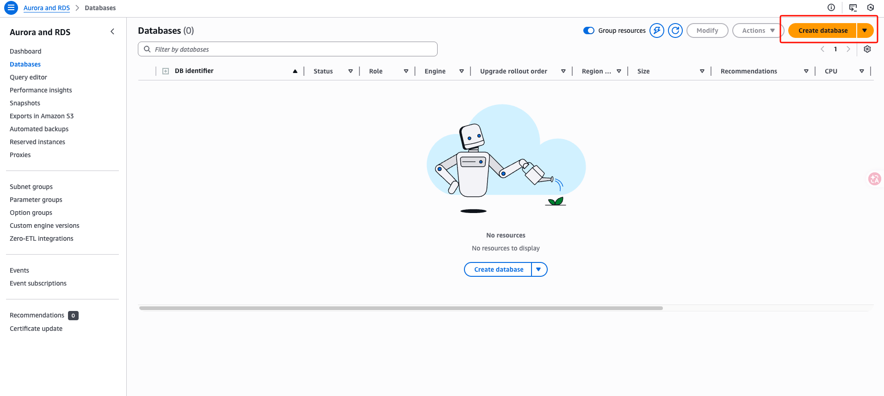

### 2. 選擇資料庫引擎

選擇 **PostgreSQL** 作為資料庫引擎。

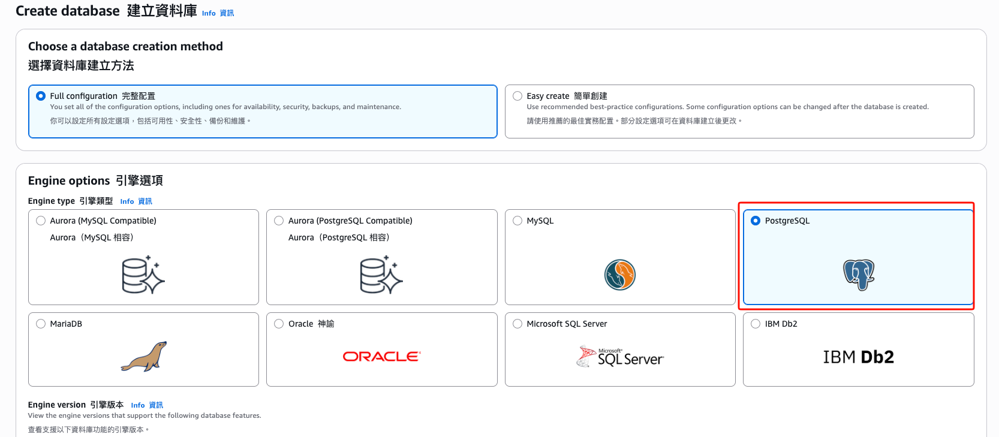

### 3. 配置部署選項

**部署方式：**  
因為僅供練習使用，選擇「單一可用區域部署」即可。

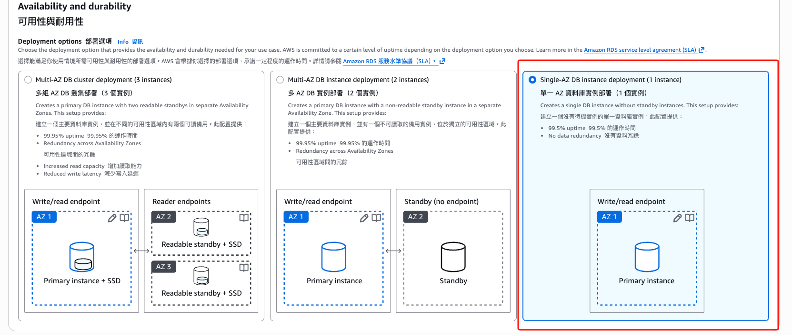

**憑證管理：**  
選擇「自我管理」，手動設定主密碼（練習環境不需使用 AWS Secrets Manager）。

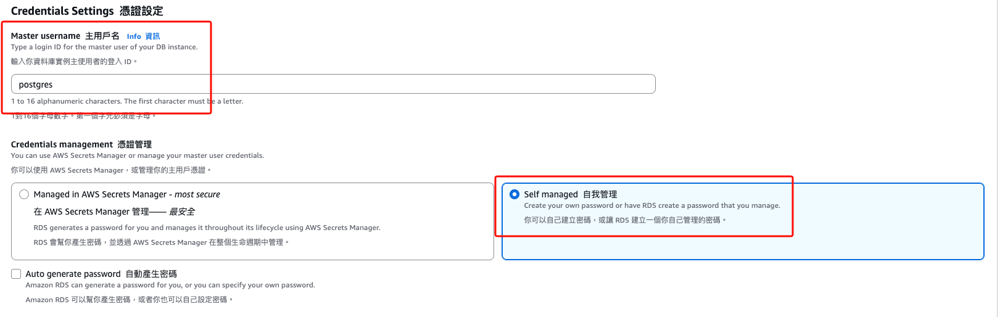

### 4. 網路設定

**公開存取：**  
為了方便測試連線，設定資料庫為「可公開存取」（生產環境不建議）。

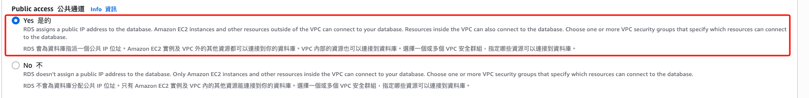

### 5. 解決子網路錯誤

**錯誤說明：**  
建立時可能遇到「需要至少 2 個可用區域的子網路」錯誤。

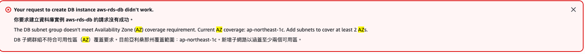

**解決方法：**  
新增一個子網路（Subnet），確保至少有 2 個可用區域（Availability Zones）。

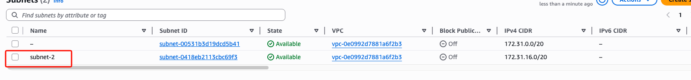

---

## 步驟二：初始化資料庫

### 1. 取得連線資訊

資料庫建立完成後，到 RDS 控制台取得連線端點（Endpoint）和連線字串。


### 2. 連接資料庫並建立資料表

使用任何 PostgreSQL 客戶端工具（如 pgAdmin、DBeaver）連接資料庫。

**建立使用者表：**

```sql
-- 建立使用者表
CREATE TABLE users (
    id SERIAL PRIMARY KEY,                                  -- 自動遞增的用戶 ID
    username VARCHAR(50) UNIQUE NOT NULL,                   -- 用戶名（唯一、不為空）
    email VARCHAR(100) UNIQUE NOT NULL,                     -- 郵箱（唯一、不為空）
    password VARCHAR(255) NOT NULL,                         -- 密碼（不為空）
    full_name VARCHAR(100),                                 -- 全名（可選）
    age INT,                                                -- 年齡（可選）
    created_at TIMESTAMP DEFAULT CURRENT_TIMESTAMP,         -- 建立時間
    updated_at TIMESTAMP DEFAULT CURRENT_TIMESTAMP          -- 更新時間
);
```

### 3. 插入測試資料

```sql
-- 插入測試資料
INSERT INTO users (username, email, password, full_name, age) VALUES
('john_doe', 'john@example.com', 'hashed_password_1', 'John Doe', 28),
('jane_smith', 'jane@example.com', 'hashed_password_2', 'Jane Smith', 32),
('bob_wilson', 'bob@example.com', 'hashed_password_3', 'Bob Wilson', 25);
```

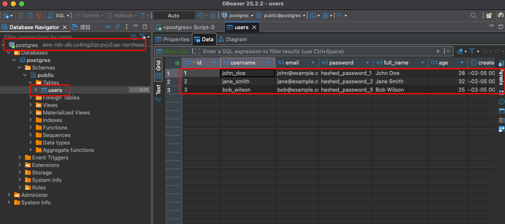

---

## 步驟三：建立 Lambda Layer

### 1. 問題說明

Lambda 函數預設不包含 `pg` 模組，執行時會出現 `module not found` 錯誤。需要建立 Lambda Layer 來提供 PostgreSQL 客戶端依賴。

### 2. 建立 Layer 套件

在本地環境執行以下指令：

```bash
# 建立目錄結構
mkdir -p lambda-layer/nodejs/node_modules
cd lambda-layer/nodejs

# 安裝 pg 模組
npm install pg

# 返回上層並打包成 ZIP
cd ..
zip -r ../pg-layer.zip nodejs/

# 檢查 ZIP 檔案
ls -lh ../pg-layer.zip
```

### 3. 上傳 Layer 到 AWS

1. 進入 AWS Console → **Lambda** → **Layers**
2. 點擊「建立 Layer」
3. 填寫設定：
   - **名稱：** `pg-module`
   - **描述：** `PostgreSQL client for Lambda`
   - **上傳 ZIP 檔案：** 選擇剛才建立的 `pg-layer.zip`

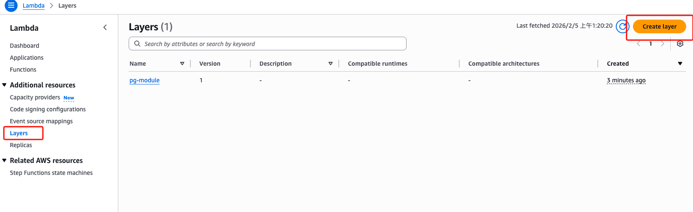

4. 上傳完成

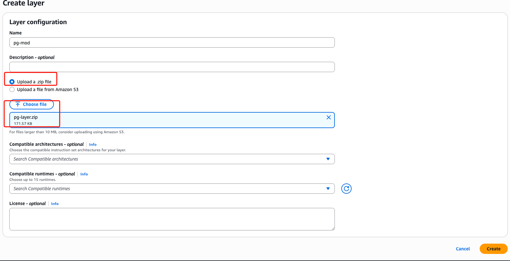

---

## 步驟四：配置 Lambda 函數

### 1. 新增 Layer 到 Lambda

進入你的 Lambda 函數，在「Layers」區塊點擊「新增 Layer」，選擇剛才建立的 `pg-module`。

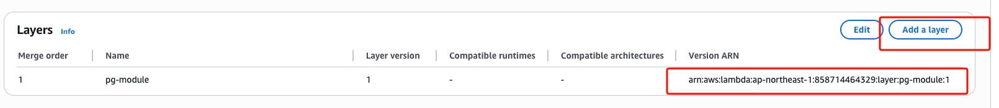

### 2. 配置環境變數（建議）

在 Lambda 函數的「配置」→「環境變數」中，設定以下變數：

```
DB_HOST=your-rds-endpoint.rds.amazonaws.com
DB_PORT=5432
DB_NAME=your-database-name
DB_USER=your-username
DB_PASSWORD=your-password
```

---

## 測試結果

配置完成後，執行 Lambda 函數，成功連接 RDS 並查詢資料。

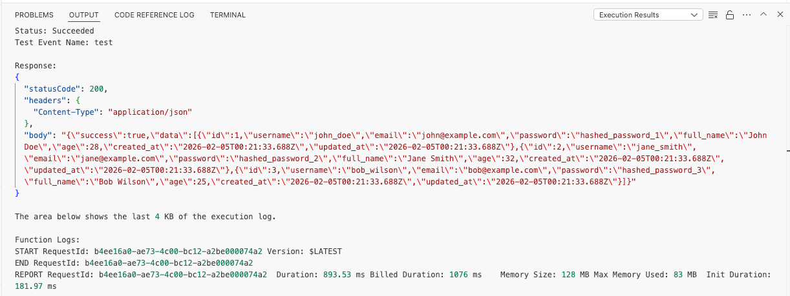

---

## 生產環境配置：私有 RDS 存取

### 問題：如果 RDS 設為私有（Private），Lambda 該如何存取？

在生產環境中，RDS **不應該**設為公開存取。以下是讓 Lambda 存取私有 RDS 的正確方法：

### 解決方案：將 Lambda 部署到 VPC 內

#### 配置步驟

1. **將 Lambda 函數部署到與 RDS 相同的 VPC**
   - 進入 Lambda 函數 → Configuration → VPC
   - 選擇與 RDS 相同的 VPC
   - 選擇**私有子網路**（Private Subnets）- 至少 2 個不同可用區域
   - 選擇適當的安全群組（Security Group）

2. **設定安全群組規則**
   
   **RDS 安全群組入站規則（Inbound Rules）：**
   ```
   Type: PostgreSQL
   Protocol: TCP
   Port: 5432
   Source: Lambda 函數的安全群組
   ```

   **Lambda 安全群組出站規則（Outbound Rules）：**
   ```
   Type: All traffic
   Protocol: All
   Destination: 0.0.0.0/0（或更嚴格的規則）
   ```

3. **配置 NAT Gateway（如果 Lambda 需要存取外部網路）**
   - 在公有子網路建立 NAT Gateway
   - 更新私有子網路的路由表，將 `0.0.0.0/0` 指向 NAT Gateway
   - 這樣 Lambda 才能同時存取 RDS 和外部 API/服務

#### 架構圖示

```
┌─────────────────── VPC ───────────────────┐
│                                            │
│  ┌─── Public Subnet ───┐                  │
│  │                      │                  │
│  │   NAT Gateway        │                  │
│  │   (Internet Access)  │                  │
│  └──────────────────────┘                  │
│            │                               │
│            ▼                               │
│  ┌─── Private Subnet ──┐                  │
│  │                      │                  │
│  │  Lambda Function ────┼──► RDS Instance │
│  │  (VPC-enabled)       │    (Private)    │
│  │                      │                  │
│  └──────────────────────┘                  │
│                                            │
└────────────────────────────────────────────┘
```

### 優缺點分析

#### ✅ 優點

| 項目 | 說明 |
|------|------|
| **安全性高** | RDS 不暴露在公共網路上，降低被攻擊風險 |
| **符合合規要求** | 滿足多數企業和法規的安全標準 |
| **內部網路通訊** | Lambda 與 RDS 之間使用私有 IP，延遲更低 |
| **訪問控制** | 透過安全群組精確控制流量來源 |

#### ⚠️ 缺點與取捨

| 項目 | 說明 | 解決方案 |
|------|------|----------|
| **冷啟動時間增加** | VPC Lambda 需要建立 ENI（Elastic Network Interface），首次啟動會增加 5-10 秒 | 使用 [Provisioned Concurrency](https://docs.aws.amazon.com/lambda/latest/dg/provisioned-concurrency.html) 保持函數預熱 |
| **額外成本** | NAT Gateway 費用約 $0.045/小時 + 流量費用 | 如果不需要外部網路存取，可以不使用 NAT Gateway |
| **配置複雜度** | 需要理解 VPC、子網路、路由表、安全群組等概念 | 使用 Infrastructure as Code（如 Terraform、CloudFormation）管理 |
| **無法直接存取公共 API** | 私有子網路中的 Lambda 預設無法存取網際網路 | 透過 NAT Gateway 或 VPC Endpoints 解決 |
| **除錯困難** | 無法直接從本地連接 RDS 進行測試 | 使用 Bastion Host 或 AWS Systems Manager Session Manager |

### 成本估算（以 us-east-1 為例）

| 項目 | 費用 |
|------|------|
| NAT Gateway（運行時間） | $0.045/小時 ≈ $32.4/月 |
| NAT Gateway（數據處理） | $0.045/GB |
| Lambda ENI | 免費 |
| VPC | 免費 |

💡 **省錢技巧：** 如果 Lambda 只需存取 RDS 而不需要外部網路，可以**不使用 NAT Gateway**，節省約 $32/月。

### 替代方案：RDS Proxy

對於高並發場景，建議使用 **RDS Proxy**：

```
Lambda → RDS Proxy → RDS Instance
```

**優點：**
- 管理資料庫連線池，避免連線數耗盡
- 減少 Lambda 冷啟動時的資料庫連線時間
- 支援 IAM 認證，無需管理密碼
- 自動處理故障轉移

**成本：** 
- $0.015/小時/vCPU ≈ $11/月（單 vCPU）

---

## 注意事項

### 安全性

- **生產環境必須**將 RDS 設為私有存取
- 密碼應使用 **AWS Secrets Manager** 管理
- Lambda 與 RDS 應配置在同一個 **VPC** 內，並設定適當的**安全群組規則**
- 定期輪換資料庫密碼
- 啟用 RDS 加密（靜態和傳輸中）

### 成本優化

- 本專案僅供學習使用，記得在完成後刪除資源以避免產生費用
- 可使用 **RDS Proxy** 來管理資料庫連線池，減少連線開銷

### 擴展建議

- 使用連線池（如 `pg-pool`）提升效能
- 實作錯誤處理與日誌記錄
- 整合 API Gateway 建立完整的 RESTful API

---

## 參考資料

- [AWS Lambda Layers 官方文件](https://docs.aws.amazon.com/lambda/latest/dg/configuration-layers.html)
- [AWS RDS 最佳實踐](https://docs.aws.amazon.com/AmazonRDS/latest/UserGuide/CHAP_BestPractices.html)
